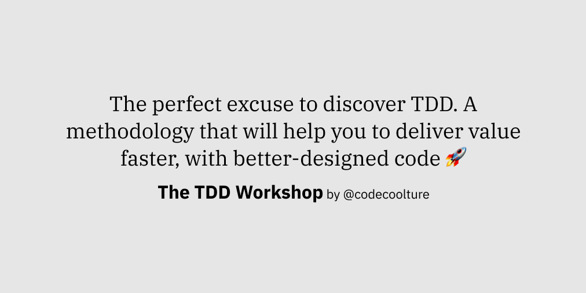

<h1 align="center">
  React ATDD Playground (with Next.js) 🎈
</h1>

<div align="center">
  

  <p>
    Hire
    <strong><a href="https://tddworkshop.com" target="blank">The TDD Workshop</a></strong>
    by
    <strong><a href="https://codecoolture.com" target="">Codecoolture</a></strong>.
  </p>
</div>

## Hi 👋,

Here you may find a template with a working project skeleton to (deliberate) practice your test-driven development skills (or _just_ front-end testing or front-end development in general).

## What's in the box?

- A [**React**](https://reactjs.org/) app (with [**Next.js**](https://nextjs.com)): so you can exercise with different kinds of components: UI blocks, pages...
- [**Cypress**](https://cypress.io): an acceptance testing framework to do browser testing, using JavaScript.
- [**Testing Library Suite**](https://testing-library.com/): a complete set of tools to do unitary/integration testing at the component level.
  - [**`@testing-library/cypress`**](https://testing-library.com/docs/cypress-testing-library/intro): this provides Cypress with Testing Library-like queries to access the DOM.
  - [**`@testing-library/react`**](https://testing-library.com/docs/react-testing-library/intro): bridge to make React components to work with Testing Library.
  - [**`@testing-library/jest-dom`**](https://testing-library.com/docs/ecosystem-jest-dom): this expands the set of default matchers from Jest to be more DOM-friendly.
  - [**`@testing-library/user-event`**](https://testing-library.com/docs/ecosystem-user-event): utility library to make it easier to reproduce browser-like interactions (such as `user.type` or `user.click`).

## How to play?

First, you will need to install the required dependencies. They can be all automatically installed by using `yarn`:

```sh
$ yarn install
```

Then, there are available 3 yarn scripts to execute different parts of the test suite:

```sh
$ yarn test:all # it will run all the tests
$ yarn test:acc # it will run only the Cypress test suite
$ yarn test:unit # it will run only the Jest & Testing Library test suite
```

If you're starting with TDD, there are some resources [here](https://www.notion.so/codecoolture/Public-References-50b1e927fe1641748f95610353e97b7f) that may help you through the journey. If you don't know where to start, [programming katas](<https://en.wikipedia.org/wiki/Kata_(programming)>) are a popular mechanism to practice TDD ([here](https://codingdojo.org/KataCatalogue/) you may find some popular ones). Though they are not specifically targeted for front-end, it should be easy to add a small UI layer on top of them :-)

## Other useful commands

Besides the above testing-related commands, these may help you during your practice session:

```sh
$ yarn dev # starts the app at http://localhost:3000
$ yarn cy:open # opens the Cypress interactive UI
$ yarn lint # lints the project by using ESLint (similar to what your editor probably already does)
```
